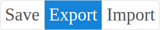

# react-button-group

> A carefully crafted button-group for React



## Install

```sh
$ npm install react-button-group --save
```

## Usage

If you want to change the border for the buttons in the group, just specify `style.border`

Example

```jsx
var Group = require('react-button-group')

<Group defaultPressedIndex={1} keepOnePressed style={{fontSize: 20, borderRadius: 5}}>
    <Button>Save</Button>
    <Button>Export</Button>
    <Button>Import</Button>
</Group>
```

The module also exports those properties:

 * Button
 * SplitButton
 * DropDownButton

So you can include any of those in a group.


## Properties

 * keepOnePressed: Boolean
 * pressedIndex: Number
 * defaultPressedIndex: Number
 * onToggle: Function(pressed, index) - Called when a button has been pressed. Called with 2 args: pressed boolean value and the index of the button in the group.
 * commonStyle: Object - styles to be applied to all buttons in the group

 * manageRadius: Boolean
 * manageBorder: Boolean

 ## Changelog

 See [changelog](./CHANGELOG.md)

 ## Contributing

 Use [Github issues](https://github.com/zippyui/react-button-group/issues) for feature requests and bug reports.

 We actively welcome pull requests.

 For setting up the project locally, use:

 ```sh
 $ git clone https://github.com/zippyui/react-button-group
 $ cd react-button-group
 $ npm install
 $ npm serve # to start http server
 $ npm dev   * to start webpack-dev-server
 ```

 Now navigate to [localhost:9091](http://localhost:9091/)

 Before building a new version, make sure you run

 ```sh
 $ npm run build
 ```
 which compiles the `src` folder (which contains jsx files) into the `lib` folder (only valid EcmaScript 5 files).

 ## License

 #### MIT